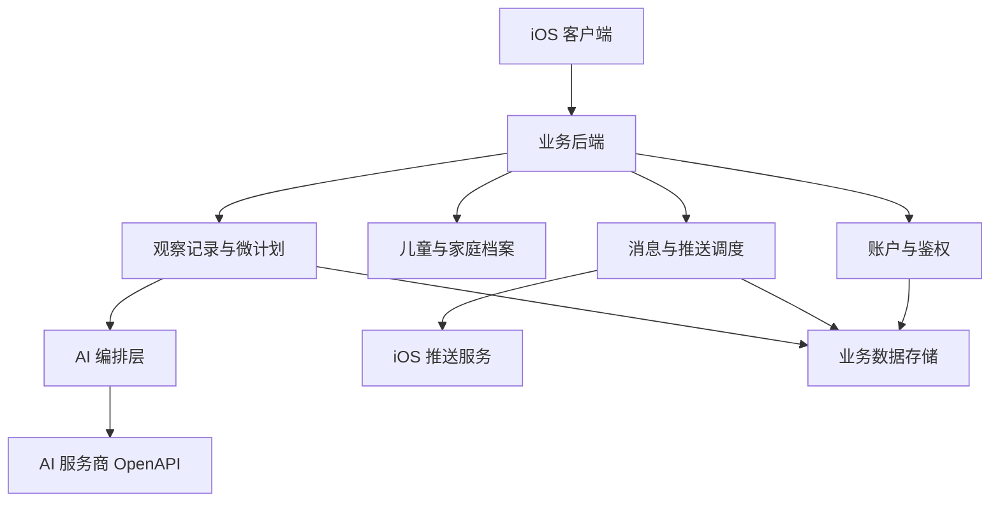

## User Requirements

- 在既有《观测模型结构稿 V1.1》《三阶段具体观察项清单 V1》《7 天微计划模板 V1》《7 天微计划示范样稿 V1》基础上，补充一份独立的整体服务架构文档。
- 本轮仍然面向家长端产品定义，只固化系统分工与服务边界，不进入页面原型、接口细节或代码实现。
- 文档需覆盖用户登录注册、儿童与家庭信息承接、观察与计划相关记录保存、与 AI 服务商交互、消息推送与提醒回流等主链路。
- 表达继续保持专业、克制、非诊断化，并与低屏幕、强亲子、线下执行优先的既有原则一致。

## Product Overview

本轮产出应是一份以章节和表格为主的结构化文档，清晰说明家长端产品从注册建档、日常记录、AI 支持、计划承接到提醒回流的整体服务结构。文档重点不是界面长相，而是系统如何稳定支撑“观察—行动—复盘”的完整闭环。

整体呈现应层次清楚、边界明确，能够直接作为后续页面信息架构与能力拆分的前置依据。

## Core Features

- 整体服务分层：明确端上能力、系统承接能力与外部服务关系。
- 核心模块职责：梳理账户、档案、观察记录、微计划、AI 交互、通知消息等模块。
- 关键闭环说明：描述用户输入、系统处理、结果返回与提醒回流的主要链路。
- 安全与边界约束：说明非诊断化、数据保存、风险升级与异常场景处理边界。
- 文档衔接关系：对齐既有观察模型、微计划体系与后续页面信息架构。

## Tech Stack Selection

- 已确认的系统形态：
- **客户端**：原生 iOS 应用
- **业务承接**：统一业务后端
- **AI 能力**：后端调用外部 AI 服务商 OpenAPI
- **消息触达**：后端调度并对接 iOS 推送体系
- **数据承载**：结构化业务数据存储，必要时配合对象存储保存附件或扩展资料
- 当前阶段**不强行锁定具体后端语言与框架**。本轮重点是先把服务边界、模块职责、数据流与安全约束写稳，避免在无代码约束时过早定型。

## Implementation Approach

采用“**独立架构文档补充**”策略，而不是重写现有产品设计稿。基于已确认的产品定位、观察模型与微计划体系，新建一份 `ai_parenting_service_architecture_v1.md`，用统一术语把 iOS 客户端、业务后端、AI 编排与推送链路串成可落地的服务骨架。

高层工作方式是：先复用现有文档中的稳定对象与闭环，再新增服务视角下的分层架构、模块职责、主流程、异常处理与安全边界。关键技术决策包括：**AI 统一经后端代理调用**、**推送统一由后端调度**、**当前以后端模块化单体视角描述能力边界**。这样既能保证后续页面信息架构有稳定依托，也能避免在文档阶段引入过重的系统拆分。

### 性能与可靠性

- 常规账户、档案、记录读写以单次请求局部读写为主，目标是低耦合、低链路复杂度。
- 主要瓶颈在 **AI 外部调用延迟、失败重试、限流** 与 **推送批量调度、防重复送达**。
- 文档中应明确的控制点：
- AI 调用走异步或可降级路径，避免阻塞主流程
- 关键写入使用幂等标识，防止重复提交
- 推送记录保留发送状态与去重标识
- 用户可见结果优先读取已结构化摘要，避免重复拼接高成本上下文

## Implementation Notes

- 术语必须复用现有文档中的“观察、微计划、周复盘、建议咨询”等表达，避免同义重写造成后续页面混乱。
- AI 服务商密钥、Prompt 模板、模型路由与审计信息全部留在后端，不下放到 iOS。
- 记录体系应区分“原始交互留存”和“家长可读摘要”，避免高频日志直接污染用户侧表达。
- 推送链路要写明设备绑定、退订控制、失败重试与送达记录，防止提醒失控。
- 保持向前兼容，不借本轮文档补充去改写既有观察模型和微计划结构。

## Architecture Design

### System Structure

- **iOS 客户端层**
- 登录注册与会话承接
- 儿童与家庭信息录入
- 观察记录、打卡、周计划查看
- AI 求助入口、消息中心、本地缓存与权限管理

- **业务后端层**
- 账户与鉴权
- 家庭与儿童档案
- 观察记录与周回顾
- 微计划状态与执行进度
- 推送调度、消息中心、审计日志

- **AI 编排层**
- Prompt 组装
- 上下文裁剪与结构化输入
- OpenAPI 调用
- 结果清洗、降级与安全边界控制

- **外部基础服务层**
- AI 服务商 OpenAPI
- iOS 推送服务
- 数据存储与对象存储
- 日志监控与运营支撑

### Core Relationship Diagram



### Main Data Flows

1. **账户链路**：iOS 提交注册登录信息，后端完成鉴权并建立用户与设备关系。
2. **记录链路**：家长在 iOS 输入观察、打卡或反馈，后端保存结构化记录并关联儿童阶段与主题。
3. **AI 链路**：后端基于档案、观察、计划状态组装上下文，调用 OpenAPI 后返回家长可读结果。
4. **触达链路**：后端按计划节奏、事件触发或风险状态生成提醒，再通过推送服务回流到 iOS。

## Directory Structure

### Directory Structure Summary

本轮以**新增独立服务架构文档**为主，只补充最小必要的会话概览更新，不改动既有观察与微计划主文档。

```text
/Users/tanghan/Library/Application Support/WorkBuddy/User/globalStorage/tencent-cloud.coding-copilot/brain/8ac2d304540345c08966c7afc14a53f6/
├── ai_parenting_service_architecture_v1.md   # [NEW] 整体服务架构主文档。固化 iOS、后端、AI 编排、推送基础设施四层结构，说明核心模块职责、主数据流、异常降级、安全边界，以及与观察模型、微计划、页面信息架构的衔接关系。
└── overview.md                               # [MODIFY] 会话概览同步文件。补记本轮新增服务架构文档的结论、验证边界与后续推进顺序，明确页面信息架构将以该服务骨架为前置约束。
```

## Agent Extensions

### Skill

- **brainstorming**
- Purpose: 收敛 iOS 客户端、业务后端、AI 编排与推送链路的分层边界与核心模块。
- Expected outcome: 形成稳定、不过度复杂、可直接写入架构文档的服务骨架。

- **writing-clearly-and-concisely**
- Purpose: 统一服务架构文档与 `overview.md` 的表达风格，保持克制、清晰、可承接后续页面信息架构。
- Expected outcome: 生成专业、简洁、非诊断化且便于后续继续引用的文档内容。