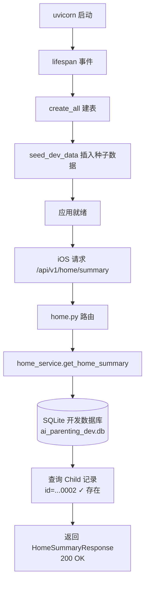

## 用户需求

iOS 客户端启动后请求后端 API `GET /api/v1/home/summary?child_id=00000000-0000-0000-0000-000000000002` 返回 500 Internal Server Error，需要排查并修复。

## 产品概述

修复后端 500 错误，使 iOS 客户端能够正常获取首页聚合数据并渲染界面。确保开发环境下无需额外安装 PostgreSQL 即可运行完整的前后端联调。

## 核心功能

- 将开发环境默认数据库从 PostgreSQL 切换为 SQLite（文件型），消除外部数据库依赖
- 应用启动时自动建表（所有 9 张 ORM 表：users, devices, children, records, plans, day_tasks, ai_sessions, weekly_feedbacks, messages）
- 自动插入种子数据：默认 User（id=00000000-...0001）和 Child（id=00000000-...0002），与 iOS 端硬编码的 UUID 对齐
- 添加全局数据库异常处理，避免裸 500 错误

## 技术栈

- 语言: Python 3.11+
- 框架: FastAPI + SQLAlchemy 2.0 (async) + Pydantic v2
- 数据库: SQLite + aiosqlite（开发）/ PostgreSQL + asyncpg（生产）
- 构建: setuptools + pyproject.toml
- 运行: uvicorn --reload

## 实现方案

### 根因分析

500 错误的调用链为：`home.py:get_home_summary` -> `home_service.get_home_summary` -> `child_service.get_child(db, child_id)` -> SQLAlchemy 执行 `select(Child).where(...)` -> 连接 `postgresql+asyncpg://localhost:5432/ai_parenting` 失败 -> 未捕获异常 -> 500。

三层根因叠加：

1. 默认 `database_url` 指向不存在的 PostgreSQL 实例
2. `app.py` 无 lifespan 事件建表
3. 无种子数据

### 策略

参考 `tests/conftest.py` 中已验证的 SQLite + aiosqlite 方案（74 个测试全部通过），将开发环境切换为 SQLite 文件数据库。`models.py` 中的 `GUID`、`JSONType`、`ArrayType` 自定义类型已实现跨数据库兼容（PostgreSQL/SQLite），切换零改动。

### 关键技术决策

1. **默认 SQLite 而非要求安装 PostgreSQL**：开发体验优先。`config.py` 默认 `database_url` 改为 `sqlite+aiosqlite:///./ai_parenting_dev.db`，生产环境通过 `AIP_DATABASE_URL` 环境变量覆盖为 PostgreSQL。

2. **lifespan 事件而非 Alembic migration**：当前为 MVP 开发阶段，schema 频繁变动，`create_all` 更适合。lifespan 在 app 启动时建表 + 插入种子数据。

3. **幂等种子数据**：`seed.py` 先查询目标记录是否存在，不存在才插入，支持多次重启不重复。

4. **aiosqlite 提升为主依赖**：当前仅在 `[project.optional-dependencies] dev` 中，但开发运行时（非测试）也需要。

5. **SQLite connect_args**：`database.py` 需要根据 URL 判断 SQLite 场景，添加 `check_same_thread=False`（SQLite 需要），参考 conftest.py 中的模式。

## 实现注意事项

- **database.py 条件配置**：当 `database_url` 包含 `sqlite` 时，需传入 `connect_args={"check_same_thread": False}`，PostgreSQL 不需要此参数。
- **seed.py 使用独立 session**：种子数据插入应使用独立 session 并 commit，不影响后续请求的事务隔离。
- **全局异常处理**：在 `app.py` 注册 `Exception` handler，捕获 SQLAlchemy `OperationalError` 返回 503（Service Unavailable）+ 可读错误信息。
- **不修改 models.py**：所有跨数据库兼容类型已就绪，无需任何改动。
- **不修改 tests/**：conftest.py 已独立配置测试数据库，与生产/开发配置互不影响。
- **不修改 iOS 端代码**：种子数据对齐 iOS 硬编码的 UUID。
- **`.gitignore`**：应忽略 `*.db` 文件（开发 SQLite 数据库文件）。

## 架构设计

当前架构无需变更，仅修复启动流程：



## 目录结构

```
src/ai_parenting/backend/
├── config.py           # [MODIFY] 默认 database_url 改为 sqlite+aiosqlite:///./ai_parenting_dev.db
├── database.py         # [MODIFY] 根据 database_url 判断是否添加 SQLite connect_args
├── app.py              # [MODIFY] 添加 lifespan 事件（建表+种子数据）+ 全局异常处理中间件
├── seed.py             # [NEW] 幂等种子数据脚本，插入默认 User + Child
├── ...

pyproject.toml          # [MODIFY] aiosqlite 从 dev 依赖提升到主依赖
.gitignore              # [MODIFY] 添加 *.db 忽略规则
```

## Agent Extensions

### SubAgent

- **code-explorer**
- 用途: 如果在实现过程中需要确认 models.py 中 ORM 模型的字段定义、service 层查询逻辑或 conftest.py 的 SQLite 配置细节，使用 code-explorer 快速检索
- 预期结果: 确认所有改动与现有代码兼容，避免引入回归