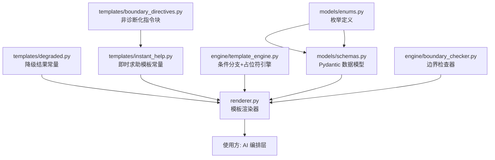

## 用户需求

将《Prompt 模板 V1》文档中已设计完毕的即时求助（InstantHelpResult）Prompt 模板，从设计文档转化为可直接被 AI 编排层加载运行的 Python 代码实现。

## 产品概述

本任务是 18-48 个月幼儿家长辅助型 AI 产品从设计文档体系进入工程代码实现的第一步。即时求助是该产品中对响应速度要求最高（首次超时 8 秒）、用户体感最直接的 AI 功能。家长在高压时刻选择问题场景或输入描述后，系统通过 AI 编排层调用模型，返回一个结构化的"三步支持结果"（InstantHelpResult）。

## 核心功能

- **数据模型定义**：用 Pydantic v2 实现 InstantHelpResult / StepContent / OutputMetadata / ContextSnapshot 等数据类型，包含字段约束（最大长度、必填/可选、枚举值）和序列化验证
- **Prompt 模板常量**：将设计文档中的完整即时求助 Prompt 模板文本定义为 Python 代码中的可管理常量，包括系统角色、输出格式约束、阶段适配指令、风险层级适配指令、生成指令等全部段落
- **非诊断化指令块**：作为独立可复用模块，供三类模板共享；包含 6 类禁用词、替代表达和语气要求
- **条件分支渲染引擎**：实现 `{{#if variable == "value"}}...{{/if}}` 语法的运行时解析，根据 ContextSnapshot 实际值决定保留/移除分支块
- **占位符替换**：实现 `{{variable_name}}` 占位符的字符串替换，将 ContextSnapshot 各字段和即时求助专属字段注入到 Prompt 模板中
- **模板渲染主流程**：接受 ContextSnapshot + 用户输入，输出完整的、可直接发送给模型的 Prompt 文本
- **降级结果预置**：将降级版 InstantHelpResult 作为代码常量，供编排层在模型超时/结构不合格/边界检查不通过时返回
- **边界检查器**：实现硬规则层的非诊断化边界检查（诊断标签黑名单、治疗承诺黑名单、绝对判断黑名单、过度量化黑名单、字段完整性、字符长度）
- **模板版本管理**：版本号常量、模板 ID、模板注册表结构

## 技术栈

- **语言**：Python 3.11+
- **数据验证**：Pydantic v2（BaseModel + Field 约束 + validator）
- **枚举定义**：Python enum.Enum / StrEnum
- **模板渲染**：自定义轻量模板引擎（正则解析条件分支 + 占位符替换），不引入 Jinja2 等重依赖
- **边界检查**：正则表达式匹配（re 模块）
- **测试**：pytest
- **包管理**：标准 pyproject.toml

选择自定义轻量模板引擎而非 Jinja2 的理由：

1. 条件分支语法已在设计文档中固定为 `{{#if var == "val"}}...{{/if}}`，与 Jinja2 语法不兼容
2. 模板引擎只需支持两种操作——简单变量替换和等值条件分支——复杂度极低
3. 避免为 AI 编排层引入不必要的模板框架依赖

## 实现方案

### 整体策略

采用"模型层 → 常量层 → 引擎层 → 组装层"四层结构，自底向上实现：

1. **模型层**（models）：用 Pydantic v2 定义所有数据结构，包含字段约束验证，确保 AI 输出在反序列化时即完成结构校验
2. **常量层**（templates/constants）：将 Prompt 模板文本、非诊断化指令块、降级结果作为 Python 多行字符串常量管理，每个模板段落独立定义以支持组合和测试
3. **引擎层**（engine）：实现条件分支解析器和占位符替换器，作为通用工具供三类模板共用
4. **组装层**（renderer）：将模型、常量、引擎组合，提供 `render_instant_help_prompt(context, user_input)` 高层接口

### 关键技术决策

**Pydantic v2 字段约束而非手动校验**：利用 `Field(max_length=...)` 和 `field_validator` 在反序列化时自动执行长度/非空/枚举校验，减少手写校验代码。对 AI 返回的 JSON 做 `InstantHelpResult.model_validate_json(raw)` 即可完成结构+约束一次性校验。

**模板文本分段存储**：将系统角色、输出格式约束、上下文注入区、阶段适配、风险适配、生成指令各自作为独立常量字符串，最终在渲染时拼接。好处是便于后续 A/B 测试时替换单个段落，也便于单元测试验证每段内容。

**条件分支先处理、变量替换后处理**：渲染顺序为先根据 context 值裁剪条件分支块，再做变量替换。这样避免了条件分支内的变量被提前替换导致的逻辑混乱。

**边界检查作为独立模块**：BoundaryChecker 类接受文本字段 dict，返回检查结果（passed/flags/替换后文本），可被三类输出复用。硬规则用预编译正则实现，保证单次检查在 O(n*m) 内完成（n=文本长度，m=规则数）。

### 性能与可靠性

- Pydantic v2 模型校验性能足够（单次 validate 微秒级），不构成瓶颈
- 条件分支解析用预编译正则，避免运行时重复编译
- 边界检查正则在模块加载时预编译为 `re.compile` 对象
- 降级结果为预构建的 Python 对象常量，不需要运行时计算

## 实现备注

- 所有枚举值（ChildStage、RiskLevel、FocusTheme、SessionType）必须与设计文档完全一致：`18_24m / 24_36m / 36_48m`、`normal / attention / consult`、`language / social / emotion / motor / cognition / self_care`
- 非诊断化指令块文本必须逐字复制自 `ai_parenting_prompt_templates_v1.md` 第四章，不可改写
- 降级结果文本必须逐字复制自 `ai_parenting_ai_output_schema_v1.md` 第 3.5 节
- 模板版本号初始值为 `tpl_instant_help_v1/1.0.0`
- 条件分支语法只支持 `==` 等值比较，不支持 `!=`、`<`、`>` 等运算符（设计文档中仅使用了等值比较）
- 边界检查黑名单词库直接取自 `ai_parenting_ai_output_schema_v1.md` 第 6.4 节硬规则表和 `ai_parenting_prompt_templates_v1.md` 第四章禁用词列表

## 架构设计

### 模块关系



### 数据流

```
ContextSnapshot + UserInput
        |
        v
    renderer.render_instant_help_prompt()
        |
        ├── 1. 加载模板常量（分段拼接）
        ├── 2. 注入非诊断化指令块
        ├── 3. 条件分支裁剪（engine.resolve_conditionals）
        ├── 4. 占位符替换（engine.replace_placeholders）
        |
        v
    完整 Prompt 文本 → 发送给模型
        |
        v
    模型返回 JSON → InstantHelpResult.model_validate_json()
        |
        ├── 校验失败 → 重试或降级（DEGRADED_INSTANT_HELP）
        v
    BoundaryChecker.check() → 通过 / 替换后结果
```

## 目录结构

```
/Users/tanghan/WorkBuddy/20260313102239/
├── pyproject.toml                    # [NEW] 项目配置，声明 Python 版本和 pydantic 依赖
├── src/
│   └── ai_parenting/
│       ├── __init__.py               # [NEW] 包初始化
│       ├── models/
│       │   ├── __init__.py           # [NEW] 模型包初始化，导出所有公共类型
│       │   ├── enums.py              # [NEW] 枚举定义。ChildStage / RiskLevel / FocusTheme / SessionType / SessionStatus / CompletionStatus / DecisionValue 全部枚举类型，值与设计文档严格对齐
│       │   └── schemas.py            # [NEW] Pydantic 数据模型。StepContent（title/body/example_script 含 max_length）、InstantHelpResult（三步+场景摘要+后续建议+边界说明）、OutputMetadata（模板版本/模型信息/边界检查结果/时间戳/延迟）、ContextSnapshot（儿童上下文快照 8 字段）。每个字段的 max_length 约束与 AI 输出结构草案完全一致
│       ├── templates/
│       │   ├── __init__.py           # [NEW] 模板包初始化
│       │   ├── boundary_directives.py # [NEW] 非诊断化指令块常量。将 prompt_templates_v1.md 第四章完整文本定义为 BOUNDARY_DIRECTIVES_BLOCK 常量字符串，供三类模板共享引用
│       │   ├── instant_help.py       # [NEW] 即时求助 Prompt 模板常量。将模板拆分为 SYSTEM_ROLE / OUTPUT_FORMAT / CHILD_CONTEXT / USER_INPUT / STAGE_ADAPTATION / RISK_ADAPTATION / GENERATION_INSTRUCTION 七段独立常量，以及 FULL_TEMPLATE 组合常量。模板 ID 为 tpl_instant_help_v1，版本 1.0.0
│       │   └── degraded.py           # [NEW] 降级结果常量。DEGRADED_INSTANT_HELP_RESULT 为预构建的 InstantHelpResult 实例，文本逐字取自 AI 输出结构草案 3.5 节
│       ├── engine/
│       │   ├── __init__.py           # [NEW] 引擎包初始化
│       │   ├── template_engine.py    # [NEW] 模板渲染引擎。resolve_conditionals(template, context_dict) 用预编译正则解析 {{#if var == "val"}}...{{/if}} 条件块并按 context 值裁剪；replace_placeholders(template, variables) 做 {{var}} 字符串替换；render(template, context_dict, variables) 组合两步操作
│       │   └── boundary_checker.py   # [NEW] 非诊断化边界检查器。BoundaryChecker 类封装硬规则：诊断标签黑名单/治疗承诺黑名单/绝对判断黑名单/过度量化正则/字段完整性/字符长度。check(result: InstantHelpResult) 返回 BoundaryCheckResult(passed, flags, cleaned_result)
│       └── renderer.py              # [NEW] 即时求助模板渲染器。render_instant_help_prompt(context: ContextSnapshot, user_scenario, user_input_text, child_nickname, active_plan_title, recent_records_summary) → str，完成模板加载→指令块注入→条件裁剪→占位符替换的完整流程。同时导出 parse_instant_help_result(raw_json) → InstantHelpResult 用于解析和校验模型返回
├── tests/
│   ├── __init__.py                   # [NEW] 测试包初始化
│   ├── test_enums.py                 # [NEW] 枚举值正确性测试
│   ├── test_schemas.py              # [NEW] Pydantic 模型校验测试：字段约束（超长截断/必填缺失/枚举非法值）、序列化/反序列化、完整 JSON 示例解析
│   ├── test_template_engine.py      # [NEW] 模板引擎测试：条件分支裁剪（匹配/不匹配/嵌套）、占位符替换（正常/缺失变量/特殊字符）
│   ├── test_boundary_checker.py     # [NEW] 边界检查测试：各类黑名单命中/未命中、替换正确性、字段完整性检查
│   └── test_renderer.py            # [NEW] 渲染器集成测试：完整渲染流程、不同阶段/风险组合的输出验证、降级结果有效性
```

## 关键代码结构

```python
# models/enums.py - 核心枚举（值必须与设计文档对齐）
class ChildStage(str, Enum):
    M18_24 = "18_24m"
    M24_36 = "24_36m"
    M36_48 = "36_48m"

class RiskLevel(str, Enum):
    NORMAL = "normal"
    ATTENTION = "attention"
    CONSULT = "consult"

class FocusTheme(str, Enum):
    LANGUAGE = "language"
    SOCIAL = "social"
    EMOTION = "emotion"
    MOTOR = "motor"
    COGNITION = "cognition"
    SELF_CARE = "self_care"
```

```python
# models/schemas.py - 核心数据模型签名
class StepContent(BaseModel):
    title: str = Field(..., max_length=20)
    body: str = Field(..., max_length=300)  # step_one 为 200，step_two/three 为 300
    example_script: str | None = Field(None, max_length=100)

class InstantHelpResult(BaseModel):
    step_one: StepContent  # body max_length=200
    step_two: StepContent  # body max_length=300
    step_three: StepContent  # body max_length=300
    scenario_summary: str = Field(..., max_length=80)
    suggest_record: bool
    suggest_add_focus: bool
    suggest_consult_prep: bool
    consult_prep_reason: str | None = Field(None, max_length=100)
    boundary_note: str = Field(..., max_length=150)
```

```python
# engine/template_engine.py - 模板引擎核心接口
def resolve_conditionals(template: str, context: dict[str, str]) -> str: ...
def replace_placeholders(template: str, variables: dict[str, str]) -> str: ...
def render(template: str, context: dict[str, str], variables: dict[str, str]) -> str: ...
```

## Agent Extensions

### Skill

- **brainstorming**
- Purpose: 在实现模板引擎和边界检查器之前，梳理条件分支语法的边界情况和黑名单词库的完整性
- Expected outcome: 确保条件分支解析器覆盖所有设计文档中出现的语法形式，边界检查词库不遗漏

- **writing-clearly-and-concisely**
- Purpose: 确保 Prompt 模板常量中的中文文本准确复制自设计文档，代码注释简洁专业
- Expected outcome: 模板文本与设计文档逐字对齐，代码注释清晰可维护

### SubAgent

- **code-explorer**
- Purpose: 在实现过程中验证设计文档中所有字段名、枚举值、约束的精确引用
- Expected outcome: 代码中的所有常量值与设计文档 100% 对齐