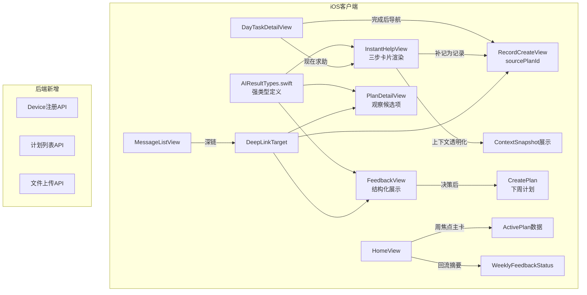

## 用户需求

根据之前完成的 iOS 客户端功能缺失分析报告（ios_gap_analysis.md），按照建议的优先级排序，依次补全全部 32 项功能缺失，使 iOS 客户端与低保真原型 V1 定义的 7 个页面功能完全对齐。

## 产品概述

一款面向 18-48 个月幼儿家长的 AI 辅助育儿应用，核心闭环为"计划执行 → 记录留证 → 反馈回流"。当前 iOS 客户端已完成页面骨架和 API 通信层搭建（27 端点对齐、12 枚举对齐、MVVM 架构），但主闭环连通性、AI 结果渲染和消息深链回流三个维度存在实质性缺失。

## 核心功能（按优先级批次）

### 第一批 P0：主闭环连通

- 计划任务完成后导航到记录页，传递 source_plan_id 建立证据链关联
- AI 即时求助结果解析 AnyCodable JSON 为强类型结构体，渲染三步卡片（先说什么/接着做什么/没接住怎么办）
- 主闭环导航打通：计划 → 记录 → 反馈 → 下周计划的完整流转
- AI 结果回流动作：补记为记录、加入本周关注

### 第二批 P1：模块完整性

- 首页周焦点主卡（阶段标签+主题+风险状态+建议）+ 待处理回流摘要卡
- 记录页增加语音记录入口 + 快速打点（预设标签一键提交，联动 observation_candidates）
- AI 上下文透明化展示（context_snapshot 解析）+ 后续回流动作按钮
- 消息深链回流（根据 targetPage/targetParams 跳转目标页）
- 周反馈结构化展示（positive_changes/opportunities 分区卡片）+ 保守路径说明
- 计划页增加"现在求助"上下文入口 + "周反馈与历史"导航入口
- AnyCodable 字段统一强类型化
- 风险升级前端感知（risk_alert 消息特殊处理 + child 状态刷新）

### 第三批：后端配套 + 认证系统

- 后端新增 Device 注册 API、文件上传 API、历次计划列表 API
- iOS 推送集成（APNs 注册 + 推送令牌上报 + 推送接收处理）

### 第四批 P2：细节补全

- 首页今日任务分栏展示、记录关联说明、儿童月龄自动刷新
- 计划页 observation_candidates 渲染、weekend_review_prompt、conservative_note
- 记录来源关联、时间线关联说明
- AI 降级结果差异化样式
- 消息处理状态统计、周反馈决策与下周计划联动、统计卡片样式
- Onboarding 初始阶段问答、可延后项、通知权限请求
- 多儿童切换数据刷新

## 技术栈

- **iOS 客户端**：SwiftUI + Swift Concurrency + Observation 框架（iOS 17+），MVVM 架构，Swift Package 组织
- **后端**：Python FastAPI + SQLAlchemy async + SQLite（开发），已有 AI Orchestrator 编排层
- **通信**：REST API，snake_case/camelCase 自动转换，AnyCodable 类型擦除
- **认证**：当前 MockAuthProvider（X-User-Id header），AuthProvider 协议已抽象

## 实现方案

### 核心策略

整体分 7 个实施阶段，每阶段聚焦一组紧密关联的功能模块，确保每个阶段结束后应用处于可运行状态。

### 阶段 1：AnyCodable 强类型化（基础层，所有后续依赖）

在 `Models/` 下新建 `AIResultTypes.swift`，定义所有 JSON 字段对应的强类型 Swift 结构体：

- `InstantHelpResult`：`firstSay`/`thenDo`/`fallback`/`suggestConsultPrep`
- `ContextSnapshot`：`childAge`/`currentPlan`/`recentRecords`
- `FeedbackChangeItem`：`title`/`description`/`isPositive`
- `DecisionOption`：`value`/`label`/`description`
- `ObservationCandidate`：`tag`/`label`/`isDefaultSelected`

同时为 `AnyCodable` 添加 `decode<T: Decodable>(as:)` 辅助方法，实现安全类型转换。

### 阶段 2：主闭环连通（P0 核心）

**计划 → 记录桥梁**：

- `DayTaskDetailView` 完成状态更新后，弹出 ActionSheet 提供"去记录"/"现在求助"/"留在计划页"三个选项
- "去记录"携带 `sourcePlanId` 和当前任务 `theme` 预填到 RecordCreateView
- `RecordCreateView` 新增 `sourcePlanId`/`sourceSessionId` 可选参数，创建时自动传递

**AI 结果结构化渲染**：

- `InstantHelpView` 的 `resultView` 方法重写：解析 `session.result` 为 `InstantHelpResult`，渲染三步卡片 UI
- 解析 `session.contextSnapshot` 为 `ContextSnapshot`，展示"系统已引用上下文"卡片
- 底部新增三个回流按钮：补记为记录 / 加入本周关注 / 再次提问

**主闭环导航**：

- `MainTabView` 增加 `@State var pendingNavigation` 枚举，支持跨 Tab 导航（plan→record→feedback）
- 通过 AppState 注入的导航意图驱动 Tab 切换 + NavigationPath push

### 阶段 3：首页信息密度增强（P1）

- `HomeView` 重构 `childInfoCard` 为周焦点主卡：从 `vm.activePlan` 读取 `focusTheme`/`primaryGoal`/`stage`/`riskLevelAtCreation` 展示阶段标签、主题、风险状态
- 新增"待处理回流"摘要卡：基于 `weeklyFeedbackStatus`/`unreadCount` 展示"周反馈已生成"/"有 N 条未读消息"
- 今日任务卡拆分"主练习"和"自然嵌入"双栏摘要
- 启动时调用 `refreshStage(childId)` 刷新月龄

### 阶段 4：记录页增强 + 快速打点（P1）

- `RecordCreateView` 顶部新增"快速打点"区域：从当前活跃 Plan 的 `observationCandidates` 获取预设标签，点选后一键提交（type=quick_check, tags=[选中项]）
- 新增 `VoiceRecordView`：AVAudioRecorder 集成，录音→本地保存→创建记录（type=voice, content="语音记录"），voice_url 暂用本地路径占位
- `RecordListView` 时间线条目增加 `syncedToPlan`/`sourcePlanId` 关联标注

### 阶段 5：消息深链 + 周反馈结构化（P1）

**消息深链**：

- `MessageListView` 的 messageCard 点击后解析 `targetPage`/`targetParams`，驱动导航到对应页面（plan_detail/record_create/weekly_feedback/record_list）
- 通过 AppState 中的 `DeepLinkTarget` 枚举实现跨 Tab 深链

**周反馈结构化**：

- `FeedbackView` 新增 `positiveChangesSection`：解析 `positiveChanges` 为 `[FeedbackChangeItem]`，绿色卡片列表
- 新增 `opportunitiesSection`：解析 `opportunities`，橙色卡片列表
- 新增 `conservativePathCard`：渲染 `conservativePathNote`，红色边框警示卡片
- 决策提交后触发 `createPlan(childId:)` 并导航到新计划详情

### 阶段 6：计划页补全 + 风险感知（P1-P2）

- `PlanDetailView` 底部新增"查看本周反馈"NavigationLink（绑定 weeklyFeedbackStatus）
- `DayTaskDetailView` 完成区旁新增"现在求助"按钮，携带 planId 打开 InstantHelpView sheet
- 渲染 `observationCandidates` 为可选打点列表
- Day 6-7 时展示 `weekendReviewPrompt`
- 展示 `conservativeNote` 保守路径卡片
- AppState 增加 `onChildUpdated` 回调：检测 risk_alert 消息时刷新 child 数据

### 阶段 7：后端配套 + 细节补全

**后端新增 3 个 API**：

- `POST /api/v1/devices`：Device 注册端点（push_token, platform, app_version）
- `GET /api/v1/plans?child_id=`：历次计划列表端点（分页，按 created_at 降序）
- 文件上传暂用占位端点，后续接入 OSS

**iOS 细节补全**：

- Onboarding Step 3 增加"近况一句话"文本输入
- 多儿童切换时各 ViewModel 监听 childId 变化重新加载
- AI 降级结果差异化黄色背景样式

## 实现注意事项

- **AnyCodable 解析安全性**：所有 `decode(as:)` 调用必须包裹 `try?`，解析失败降级为文本展示或空态，绝不 crash
- **导航不破坏 Tab 状态**：跨 Tab 导航使用 AppState 注入的 `pendingNavigation` 而非重新创建 View，保持各 Tab 的 NavigationPath 独立
- **复用现有模式**：所有新 ViewModel 遵循现有 `@Observable` + `.task {}` 延迟初始化模式；新 View 遵循现有 sectionCard/wire-card 组件风格
- **向后兼容**：新增字段全部使用 `decodeIfPresent`，老数据不会导致解码失败
- **性能**：快速打点的 observationCandidates 缓存在 PlanViewModel 中，避免重复解析

## 架构设计



## 目录结构

```
ios/Sources/AIParenting/
├── Models/
│   └── AIResultTypes.swift          # [NEW] 强类型定义：InstantHelpResult, ContextSnapshot, FeedbackChangeItem, DecisionOption, ObservationCandidate + AnyCodable 扩展
├── App/
│   ├── AppState.swift               # [MODIFY] 新增 DeepLinkTarget 枚举、pendingNavigation 状态、onChildUpdated 回调、childId 变化通知
│   └── MainTabView.swift            # [MODIFY] 监听 pendingNavigation 实现跨 Tab 导航；即时求助浮动按钮携带 planId
├── Features/
│   ├── Plan/
│   │   ├── DayTaskDetailView.swift  # [MODIFY] 完成后弹出导航选项（去记录/现在求助/留在计划页）；渲染 observationCandidates；显示 weekendReviewPrompt 和 conservativeNote
│   │   ├── PlanDetailView.swift     # [MODIFY] 底部新增"查看本周反馈"和"查看历次计划"入口；Day 6-7 复盘引导展示
│   │   └── PlanViewModel.swift      # [MODIFY] 缓存解析后的 observationCandidates；暴露 weeklyFeedbackStatus
│   ├── AI/
│   │   ├── InstantHelpView.swift    # [MODIFY] resultView 重写：三步卡片 + 上下文展示 + 回流按钮（补记为记录/加入关注）
│   │   └── InstantHelpViewModel.swift # [MODIFY] 新增 parsedResult/parsedContext 计算属性
│   ├── Record/
│   │   ├── RecordCreateView.swift   # [MODIFY] 新增 sourcePlanId/sourceSessionId 参数；顶部增加快速打点区域
│   │   ├── RecordListView.swift     # [MODIFY] 时间线条目增加来源关联标注
│   │   ├── RecordViewModel.swift    # [MODIFY] 创建记录时传递 sourcePlanId/sourceSessionId
│   │   └── VoiceRecordView.swift    # [NEW] 语音录制组件：AVAudioRecorder 集成 + 录音状态管理
│   ├── Feedback/
│   │   ├── FeedbackView.swift       # [MODIFY] 新增 positiveChanges/opportunities 分区卡片 + conservativePathNote 渲染 + 决策后触发新计划创建
│   │   └── FeedbackViewModel.swift  # [MODIFY] 新增 parsedPositiveChanges/parsedOpportunities；决策后调用 createPlan
│   ├── Home/
│   │   ├── HomeView.swift           # [MODIFY] 重构为周焦点主卡 + 待处理回流摘要 + 今日任务双栏拆分 + 月龄刷新
│   │   └── HomeViewModel.swift      # [MODIFY] 启动时调用 refreshStage；暴露 activePlan 详细字段
│   ├── Message/
│   │   ├── MessageListView.swift    # [MODIFY] 消息点击后根据 targetPage/targetParams 深链跳转；risk_alert 特殊样式
│   │   └── MessageViewModel.swift   # [MODIFY] 新增 navigateToTarget 方法解析深链目标
│   └── Onboarding/
│       └── OnboardingView.swift     # [MODIFY] Step 3 增加"近况一句话"文本输入
└── Core/
    └── Network/
        └── Endpoint.swift           # [MODIFY] 新增 listPlans(childId:) 端点

src/ai_parenting/backend/
├── routers/
│   ├── devices.py                   # [NEW] Device 注册/更新端点
│   └── plans.py                     # [MODIFY] 新增 GET /plans?child_id= 历次计划列表
├── schemas.py                       # [MODIFY] 新增 DeviceCreate/DeviceResponse/PlanListResponse
└── app.py                           # [MODIFY] 注册 devices router
```