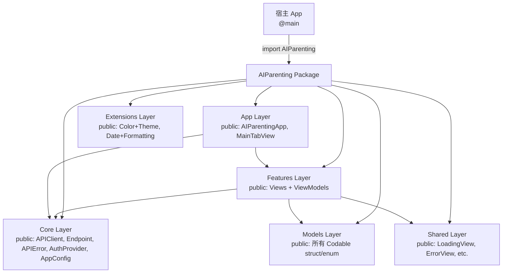

## 用户需求

iOS 客户端 Swift Package（`AIParenting`）作为 library 被宿主 Xcode App 项目通过 `import AIParenting` 引用时，报 "No such module 'AIParenting'" 错误。

## 产品概述

将 AIParenting Swift Package 中所有需要被外部模块访问的类型、属性、初始化器和方法添加 `public` 访问修饰符，使宿主 App 能够正常 `import AIParenting` 并使用 `MainTabView`、`APIClient` 等公开 API。

## 核心功能

- 为 Models 层（9 个文件）所有 struct/enum 添加 `public`，包括属性和 `init`
- 为 Core 层（Network、Auth、Config，共 6 个文件）的 protocol/class/enum/struct 添加 `public`
- 为 Features 层所有 View 和 ViewModel（14 个文件）添加 `public`
- 为 Shared 层通用组件（5 个文件）添加 `public`
- 为 Extensions 层（2 个文件）的扩展属性/方法添加 `public`
- 为 App 层（2 个文件）添加 `public`
- 确保修改后 `swift test` 仍然 74 tests, 0 failures

## 技术栈

- 语言: Swift 5.9
- 框架: SwiftUI + Swift Concurrency + Observation
- 构建系统: Swift Package Manager
- 平台: iOS 17+ / macOS 14+

## 实现方案

**策略**: 批量为 `Sources/AIParenting` 下所有 38 个 Swift 文件中需要对外暴露的类型声明添加 `public` 访问修饰符。测试代码使用 `@testable import AIParenting`，不需要修改。

**关键技术决策**:

1. **struct 的 memberwise init 问题**: Swift 不会为 `public struct` 自动生成 `public` 的 memberwise init。对于已有自定义 `init(from decoder:)` 的 model（`PlanResponse`、`HomeSummaryResponse`、`WeeklyFeedbackResponse`、`MessageResponse`），它们的自定义 init 需要标 `public`。对于其他纯数据 struct（如 `ChildCreate`、`RecordCreate` 等），需要显式添加 `public init(...)`。

2. **Codable struct 有 `var` 属性带默认值**: 如 `ChildCreate` 的 `var focusThemes: [String] = []`、`RecordCreate` 的多个可选 `var` 属性。memberwise init 需要保留默认值参数。

3. **@Observable class**: `APIClient` 和所有 ViewModel（6 个）使用 `@Observable` 宏，`init` 和对外暴露的属性/方法需要 `public`。ViewModel 的 `init` 接受 `APIClientProtocol` 参数需要 public。

4. **enum 的 case**: `public enum` 的 case 自动为 public，但计算属性（如 `displayName`、`errorDescription`）和静态方法需要显式标 `public`。

5. **protocol**: `AuthProvider` 和 `APIClientProtocol` 需要 `public protocol`，其成员要求自动变为 public。

6. **Color/Date extension**: 扩展中的 `static let` 和计算属性需要 `public static` / `public var`。

7. **宿主 App 最小公开 API**: 宿主 App 只需 `MainTabView`、`APIClient`、`AppConfig`、`MockAuthProvider`，但这些类型依赖链路上的所有类型都必须 public（如 View 引用的 Model、ViewModel 引用的 Endpoint 等），因此实际需要全部类型 public。

## 实现注意事项

- **不修改测试文件**: 所有 11 个测试文件使用 `@testable import AIParenting`，`@testable` 会解除 `internal` 访问限制，因此测试代码无需任何改动。
- **保持向后兼容**: 仅添加 `public` 修饰符，不改变任何逻辑、函数签名或数据结构。
- **AnyCodable 的 `value` 属性**: `let value: Any?` 需要 `public`，`init(_ value: Any?)` 需要 `public`。由于 `Any?` 不是 `Sendable`，这里保持现有实现不变。
- **AnyEncodable**: `APIClient.swift` 中的 `private struct AnyEncodable` 是内部实现细节，保持 `private` 不变。
- **CodingKeys enum**: 各 model 中的 `private enum CodingKeys` 保持 `private`，这是 `Codable` 的实现细节。
- **ViewModel 内部方法**: ViewModel 的 `private` 辅助方法（如 `FeedbackViewModel.startPolling`）保持 private。
- **View 的 private 子组件**: View 中的 `private func xxxCard(...)` 等私有子视图构造函数保持 private。

## 架构设计

当前架构无需变更，仅调整访问控制级别：



## 目录结构

所有修改均在 `ios/Sources/AIParenting/` 下，无新建文件：

```
ios/Sources/AIParenting/
├── App/
│   ├── AIParentingApp.swift       # [MODIFY] public struct AIParentingApp + public init + public body
│   └── MainTabView.swift          # [MODIFY] public struct MainTabView + public init + public body
├── Core/
│   ├── Auth/
│   │   ├── AuthProvider.swift     # [MODIFY] public protocol AuthProvider
│   │   └── MockAuthProvider.swift # [MODIFY] public struct MockAuthProvider + public init + public 属性
│   ├── Config/
│   │   └── AppConfig.swift        # [MODIFY] public struct AppConfig + public 属性 + public static let default/development + public init
│   └── Network/
│       ├── APIClient.swift        # [MODIFY] public protocol APIClientProtocol + public class APIClient + public init/request/requestVoid
│       ├── APIError.swift         # [MODIFY] public enum APIError + public errorDescription + public static fromHTTPStatus
│       └── Endpoint.swift         # [MODIFY] public enum Endpoint + public var method/path/queryItems/body/usesAITimeout/expectedStatusCode
├── Extensions/
│   ├── Color+Theme.swift          # [MODIFY] 所有 static let 加 public
│   └── Date+Formatting.swift      # [MODIFY] 所有 var/static func 加 public
├── Features/
│   ├── AI/
│   │   ├── InstantHelpView.swift      # [MODIFY] public struct + public init + public body
│   │   └── InstantHelpViewModel.swift # [MODIFY] public class + public init + public 状态属性 + public 方法
│   ├── Feedback/
│   │   ├── FeedbackView.swift         # [MODIFY] public struct + public init + public body
│   │   └── FeedbackViewModel.swift    # [MODIFY] public class + public init + public 状态属性 + public 方法
│   ├── Home/
│   │   ├── HomeView.swift             # [MODIFY] public struct + public init + public body
│   │   └── HomeViewModel.swift        # [MODIFY] public class + public init + public 状态属性 + public 方法
│   ├── Message/
│   │   ├── MessageListView.swift      # [MODIFY] public struct + public init + public body
│   │   └── MessageViewModel.swift     # [MODIFY] public class + public init + public 状态属性 + public 方法
│   ├── Plan/
│   │   ├── DayTaskDetailView.swift    # [MODIFY] public struct + public init + public body
│   │   ├── PlanDetailView.swift       # [MODIFY] public struct + public init + public body
│   │   └── PlanViewModel.swift        # [MODIFY] public class + public init + public 状态属性 + public 方法
│   └── Record/
│       ├── RecordCreateView.swift     # [MODIFY] public struct RecordCreateView + FlowLayout + public init + public body
│       ├── RecordListView.swift       # [MODIFY] public struct + public init + public body
│       └── RecordViewModel.swift      # [MODIFY] public class + public init + public 状态属性 + public 方法
├── Models/
│   ├── AISession.swift            # [MODIFY] public struct InstantHelpRequest/AISessionResponse + public 属性 + public init
│   ├── Child.swift                # [MODIFY] public struct ChildCreate/ChildUpdate/ChildResponse + public 属性 + public init
│   ├── Common.swift               # [MODIFY] public struct HealthResponse + public 属性 + public init
│   ├── Enums.swift                # [MODIFY] 12 个 enum 全部 public + public var displayName
│   ├── Home.swift                 # [MODIFY] public struct HomeSummaryResponse + public 属性 + public init(from:)
│   ├── Message.swift              # [MODIFY] public struct MessageUpdateRequest/MessageResponse/MessageListResponse/UnreadCountResponse + public 属性 + public init
│   ├── Plan.swift                 # [MODIFY] public struct PlanCreateRequest/DayTaskCompletionUpdate/DayTaskResponse/PlanResponse/PlanWithFeedbackStatus/AnyCodable + public 属性 + public init
│   ├── Record.swift               # [MODIFY] public struct RecordCreate/RecordResponse/RecordListResponse + public 属性 + public init
│   └── WeeklyFeedback.swift       # [MODIFY] public struct WeeklyFeedbackCreateRequest/WeeklyFeedbackDecisionRequest/WeeklyFeedbackResponse + public 属性 + public init
└── Shared/
    ├── BadgeView.swift            # [MODIFY] public struct + public init + public body
    ├── EmptyStateView.swift       # [MODIFY] public struct + public init + public body
    ├── ErrorView.swift            # [MODIFY] public struct + public init + public body
    ├── LoadingView.swift          # [MODIFY] public struct + public init + public body
    └── RefreshableScrollView.swift # [MODIFY] public struct + public init + public body
```

## 关键代码结构

需要为 `public struct` 显式添加 memberwise init 的典型模式：

```swift
// 示例：带默认值的 struct 需要显式 public init
public struct ChildCreate: Codable, Sendable {
    public let nickname: String
    public let birthYearMonth: String
    public var focusThemes: [String]
    public var riskLevel: String

    public init(nickname: String, birthYearMonth: String, focusThemes: [String] = [], riskLevel: String = "normal") {
        self.nickname = nickname
        self.birthYearMonth = birthYearMonth
        self.focusThemes = focusThemes
        self.riskLevel = riskLevel
    }
}

// 示例：已有自定义 init(from:) 的 struct 只需在 init 前加 public
public struct PlanResponse: Codable, Sendable, Identifiable {
    public let id: UUID
    // ... 其他 public 属性
    
    public init(from decoder: Decoder) throws {
        // 现有实现不变
    }
}
```

## Agent Extensions

### SubAgent

- **code-explorer**
- 用途: 在执行过程中如果需要确认某些类型的依赖关系或调用链，使用 code-explorer 快速搜索确认
- 预期结果: 准确定位所有需要 public 修饰符的声明，避免遗漏