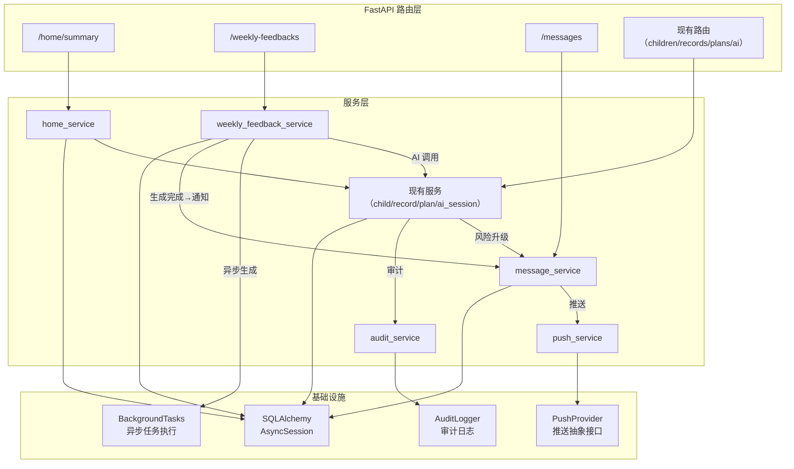

## 产品概述

实现 MS3：业务后端闭环与可靠性。在已完成的 MS2 核心数据链路（ORM、档案/记录/计划/AI 会话 API）基础上，补齐消息通知系统、异步任务框架、周反馈完整链路、首页聚合 API、风险升级机制和审计日志模块，使后端成为一个完整、可靠、可降级、可追溯的服务系统。

## 核心功能

### 1. 周反馈 API（MS2 遗留补齐）

- 周反馈生成：接收 plan_id，异步调用 AI Orchestrator（SessionType.WEEKLY_FEEDBACK），聚合本周记录和计划完成状态，生成 WeeklyFeedback 并入库
- 周反馈查询：按 ID 获取完整周反馈详情
- 决策回写：家长选择下周方向（continue/lower_difficulty/change_focus），同步更新 Plan.next_week_direction
- 计划页接口补齐：plans/active 返回真实的 weekly_feedback_status

### 2. 消息系统

- 消息列表查询（分页、未处理优先排序）
- 消息状态更新（read/processed）
- 未读计数查询
- 消息创建服务（供内部模块调用，非公开 API）
- 消息模板系统：5 种类型（plan_reminder, record_prompt, weekly_feedback_ready, risk_alert, system），每种有预定义的 title/body/summary/target_page 模板

### 3. 推送服务

- 抽象推送接口（PushProvider），类似 ModelProvider 模式
- Mock 推送实现（用于测试）
- 推送调度：创建消息后触发异步推送，更新 push_status/push_sent_at
- 送达/点击回流 API：接收客户端上报的 delivered/clicked 事件

### 4. 异步任务框架

- 基于 FastAPI BackgroundTasks 的轻量级异步任务执行器
- 异步任务场景：周反馈 AI 生成、推送发送、AI 调用失败重试
- 任务状态追踪和幂等控制

### 5. 首页聚合 API（MS2 遗留补齐）

- GET /home/summary 聚合接口：返回 child、active_plan、today_task、recent_records、unread_count

### 6. 风险升级

- AI 会话结果中检测到 suggest_consult_prep=true 时，自动将 Child.risk_level 升级为 consult
- consult 状态下 AI 调用自动注入保守模式标记

### 7. 审计日志

- AI 会话审计：记录每次 AI 调用的关键信息（session_type, child_id, status, latency, boundary_check_flags），脱敏处理（不记录完整 result 和 context_snapshot 原文）
- 边界检查审计：记录不通过的检查结果和 flags

## 技术栈

- **语言**：Python 3.11+
- **Web 框架**：FastAPI（async native）
- **ORM**：SQLAlchemy 2.0 async
- **数据库**：PostgreSQL（生产）/ SQLite + aiosqlite（测试）
- **配置**：pydantic-settings
- **测试**：pytest + pytest-asyncio + httpx AsyncClient
- **异步任务**：FastAPI BackgroundTasks（in-process，不引入 Celery 等重依赖）
- **推送**：抽象 PushProvider 接口 + MockPushProvider（APNs 真实实现留到 MS5）

## 实现方案

### 整体策略

采用**自底向上、逐层补齐**的策略，在不破坏现有 304 个测试的前提下，按"枚举补齐 → 服务层新建 → 路由新建 → 异步框架 → 审计模块"的顺序实现。每层完成后运行全量测试确保零回归。

### 关键技术决策

**1. 异步任务使用 FastAPI BackgroundTasks 而非 Celery/ARQ**

当前产品处于 MVP 阶段，异步任务场景有限（周反馈生成、推送发送、失败重试），无需引入 Redis + Celery 的重基础设施。FastAPI BackgroundTasks 在请求返回后执行后台任务，足以满足需求。幂等控制通过 AISession/Message 的状态字段实现（检查 status 是否已完成来防止重复执行），而非依赖外部任务队列的去重机制。

**2. 推送抽象为 PushProvider 接口 + Mock 实现**

与 ModelProvider 模式一致，定义 `PushProvider` 抽象基类（`send_notification` 方法），`MockPushProvider` 直接返回成功并记录调用参数。真实 APNs 实现留到 MS5。测试中通过 FastAPI 依赖注入覆盖。

**3. 周反馈采用"同步创建 + 后台生成"模式**

API 请求立即创建 status=generating 的 WeeklyFeedback 记录并返回，AI 调用放到 BackgroundTasks 中异步执行。生成完成后更新 status 为 ready 或 failed。前端通过轮询 GET /weekly-feedbacks/{id} 获取结果。

**4. 审计日志使用 Python logging 模块 + 结构化 JSON 格式**

不引入额外的审计表或日志服务。使用标准 `logging` 模块，配置专用的 `ai_parenting.audit` logger，输出结构化 JSON（包含 event_type, session_id, session_type, child_id, status, latency_ms, boundary_flags）。日志中只记录 ID 引用而不记录完整的 context_snapshot 和 result 内容，实现脱敏。

**5. 风险升级集成到 AI 会话服务的后处理流程**

在 `ai_session_service.py` 中，AI 调用成功后检查结果中的 `suggest_consult_prep` 字段。如果为 true 且 child.risk_level 不是 consult，自动升级并生成 risk_alert 类型的消息。这样风险升级与消息通知形成闭环。

### 性能与可靠性

- **周反馈生成**：后台任务执行，不阻塞 API 响应。如果 AI 调用失败，将 WeeklyFeedback.status 设为 failed 并记录 error_info，不触发重试（避免重复生成）
- **推送发送**：后台任务执行，失败时更新 push_status 为 failed，不阻塞消息创建
- **首页聚合**：单次 DB session 内完成所有查询（child + plan + today_task + records + unread_count），利用已有的 selectin 关系加载避免 N+1
- **幂等保护**：周反馈生成前检查是否已有同 plan_id 的 WeeklyFeedback（非 failed 状态），消息推送前检查 push_status 是否已为 sent/delivered

## 实现备注

- 所有新文件复用现有的跨数据库兼容类型（GUID, JSONType, ArrayType）
- 新路由器在 `app.py` 的 `create_app()` 中注册，保持 `/api/v1` 前缀
- 新依赖（get_push_provider）添加到 `deps.py`，测试中通过 `dependency_overrides` 覆盖
- `conftest.py` 需新增 `push_provider` fixture 和更新 `client` fixture 添加推送依赖覆盖
- 枚举新增 `MessageType`（plan_reminder/record_prompt/weekly_feedback_ready/risk_alert/system）和 `ReadStatus`（unread/read/processed）、`PushStatus`（pending/sent/delivered/failed）、`FeedbackStatus`（generating/ready/failed/viewed/decided）
- 修改 `plans.py` 路由中 `get_active_plan` 的硬编码 `weekly_feedback_status=None`，改为查询真实状态
- `pyproject.toml` 版本号升至 0.3.0

## 架构设计

### 系统架构



### 数据流

```
周反馈生成流程：
POST /weekly-feedbacks → 创建 WeeklyFeedback(generating) → 返回 202
                        → BackgroundTask:
                          1. 聚合 Plan 完成率 + 本周 Records
                          2. 调用 Orchestrator(WEEKLY_FEEDBACK)
                          3. 更新 WeeklyFeedback(ready) + 写入 AI 结果
                          4. 创建 Message(weekly_feedback_ready)
                          5. 异步推送通知
                          6. 审计日志记录

消息闭环流程：
事件触发（周反馈完成/风险升级/计划提醒）
  → message_service.create_message(模板+参数)
  → Message 入库(push_status=pending)
  → BackgroundTask: push_service.send(message)
  → 更新 push_status=sent/failed
  → 客户端点击 → POST /messages/{id}/clicked → 更新 clicked_at
```

## 目录结构

```
src/ai_parenting/
├── models/
│   └── enums.py                     # [MODIFY] 新增 MessageType, ReadStatus, PushStatus, FeedbackStatus 枚举
├── backend/
│   ├── app.py                       # [MODIFY] 注册 3 个新路由器（home, weekly_feedbacks, messages）
│   ├── config.py                    # [MODIFY] 新增推送相关配置项
│   ├── deps.py                      # [MODIFY] 新增 get_push_provider 依赖
│   ├── schemas.py                   # [MODIFY] 新增 WeeklyFeedbackResponse, WeeklyFeedbackDecisionRequest, MessageResponse, MessageListResponse, MessageUpdateRequest, HomeSummaryResponse 补充 pending_messages 字段
│   ├── models.py                    # [MODIFY] WeeklyFeedback 模型补充 error_info 字段; 可能需微调关系
│   ├── routers/
│   │   ├── plans.py                 # [MODIFY] get_active_plan 查询真实 weekly_feedback_status
│   │   ├── home.py                  # [NEW] 首页聚合路由。GET /home/summary 聚合 child+plan+today_task+records+unread_count，单次请求返回首页全部数据
│   │   ├── weekly_feedbacks.py      # [NEW] 周反馈路由。POST 触发生成（返回 202），GET/{id} 查询详情，POST/{id}/decision 决策回写
│   │   └── messages.py             # [NEW] 消息路由。GET 列表查询（分页+未处理优先），GET/{id} 详情，PATCH/{id} 状态更新，POST/{id}/clicked 点击回流，GET/unread-count 未读计数
│   ├── services/
│   │   ├── ai_session_service.py    # [MODIFY] AI 调用后处理中加入风险升级检测和消息触发逻辑
│   │   ├── home_service.py          # [NEW] 首页聚合服务。get_home_summary() 组合调用 child_service/plan_service/record_service/message_service，一次 DB session 完成全部查询
│   │   ├── weekly_feedback_service.py # [NEW] 周反馈服务。create_weekly_feedback() 创建记录并启动后台生成，_generate_feedback_background() 执行 AI 调用和结果入库，get_feedback()/submit_decision() 查询和决策回写
│   │   ├── message_service.py       # [NEW] 消息服务。create_message()（模板化创建），list_messages()（分页+排序），update_read_status()，get_unread_count()，record_click()，内部消息模板映射
│   │   └── push_service.py         # [NEW] 推送服务。PushProvider 抽象基类（send_notification 方法），MockPushProvider 实现，send_push() 协调推送发送和状态更新
│   └── audit.py                     # [NEW] 审计日志模块。配置专用 logger，提供 log_ai_session()/log_boundary_check()/log_risk_escalation() 方法，结构化 JSON 输出，字段脱敏
├── pyproject.toml                   # [MODIFY] 版本升至 0.3.0

tests/
├── conftest.py                      # [MODIFY] 新增 push_provider fixture，client fixture 添加推送依赖覆盖
├── test_weekly_feedback_service.py  # [NEW] 周反馈服务测试：创建、AI 生成成功/降级/失败、决策回写、重复创建幂等检查、plan weekly_feedback_status 查询
├── test_message_service.py          # [NEW] 消息服务测试：创建（各类型模板）、列表查询（排序/分页/过滤）、状态更新、未读计数、点击回流
├── test_push_service.py             # [NEW] 推送服务测试：MockPushProvider 调用验证、推送状态更新、推送失败处理
├── test_home_service.py             # [NEW] 首页聚合服务测试：全数据聚合、无计划/无记录降级、未读计数正确性
├── test_audit.py                    # [NEW] 审计日志测试：日志格式正确、脱敏验证（不含完整 context/result）
├── test_ms3_api_routes.py           # [NEW] MS3 新增 API 集成测试：首页聚合、周反馈生命周期（创建→查询→决策）、消息 CRUD、推送回流、风险升级端到端
└── test_risk_escalation.py          # [NEW] 风险升级测试：AI 返回 suggest_consult_prep 后 child.risk_level 自动升级、消息自动创建
```

## 关键代码结构

```python
# backend/services/push_service.py - 推送抽象接口
from abc import ABC, abstractmethod
from dataclasses import dataclass

@dataclass
class PushNotification:
    device_token: str
    title: str
    body: str
    data: dict[str, str] | None = None

@dataclass
class PushResult:
    success: bool
    provider_message_id: str | None = None
    error: str | None = None

class PushProvider(ABC):
    @abstractmethod
    async def send_notification(self, notification: PushNotification) -> PushResult: ...

class MockPushProvider(PushProvider):
    """测试用 Mock 推送实现，记录所有调用。"""
    def __init__(self) -> None:
        self.sent: list[PushNotification] = []

    async def send_notification(self, notification: PushNotification) -> PushResult:
        self.sent.append(notification)
        return PushResult(success=True, provider_message_id="mock-id")
```

```python
# models/enums.py - 新增枚举（追加到现有文件末尾）
class MessageType(str, Enum):
    PLAN_REMINDER = "plan_reminder"
    RECORD_PROMPT = "record_prompt"
    WEEKLY_FEEDBACK_READY = "weekly_feedback_ready"
    RISK_ALERT = "risk_alert"
    SYSTEM = "system"

class FeedbackStatus(str, Enum):
    GENERATING = "generating"
    READY = "ready"
    FAILED = "failed"
    VIEWED = "viewed"
    DECIDED = "decided"
```

## Agent Extensions

### SubAgent

- **code-explorer**
- Purpose: 在实现各步骤前验证现有代码中的具体接口签名、关系定义和 import 路径，确保新代码与现有模块无缝集成
- Expected outcome: 每个实现步骤开始前确认目标文件的当前状态和依赖关系，避免 import 错误和接口不匹配

### Skill

- **brainstorming**
- Purpose: 在实现消息模板系统和审计日志格式前，梳理 5 种消息类型的模板内容（title/body/summary/target_page）和审计日志字段的脱敏规则
- Expected outcome: 消息模板覆盖所有业务场景，审计日志格式满足可追溯且不泄露隐私的要求