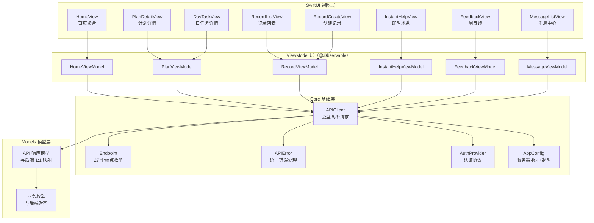
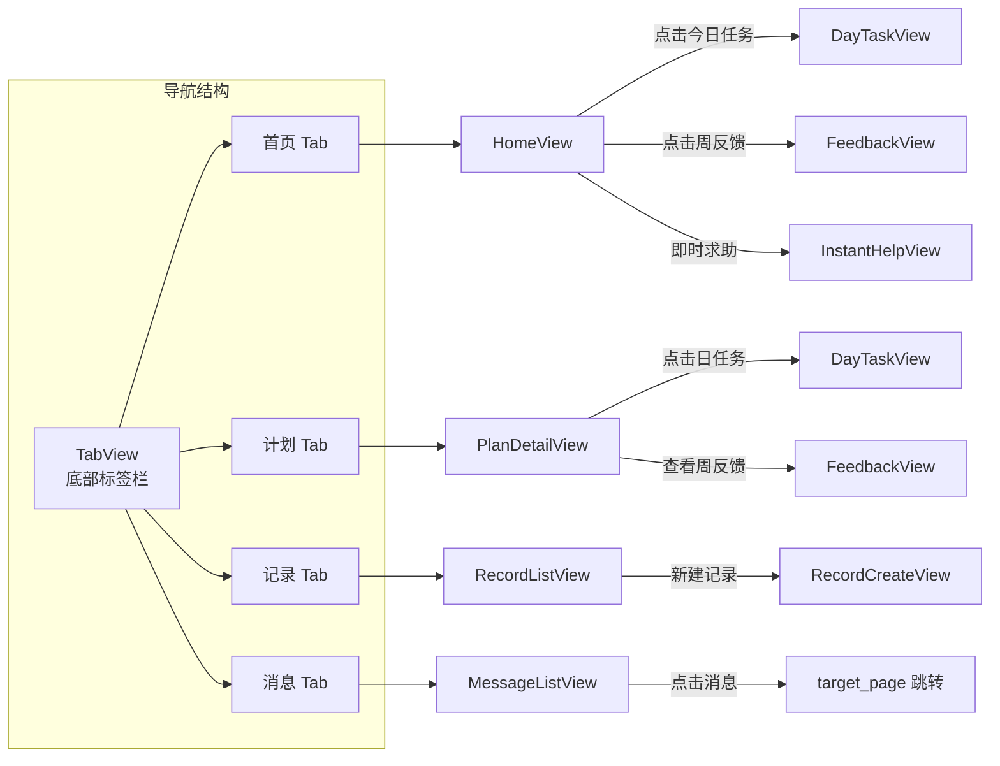

## 产品概述

构建 MS4 iOS 客户端 MVP，使用 SwiftUI 实现一个完整对接后端 27 个 API 端点的原生 iOS 应用。应用面向 18-48 个月幼儿家长，提供首页聚合、微计划管理、观察记录、即时求助、周反馈和消息中心六大核心功能。

## 核心功能

### 1. 首页聚合

- 单次请求加载 child 信息、活跃计划摘要、今日任务卡片、最近观察记录、未读消息数、周反馈状态
- 展示今日任务快速入口，点击进入任务详情
- 未读消息角标显示，点击进入消息中心
- 周反馈状态提示（ready 时引导查看）

### 2. 微计划管理

- 展示 7 天任务日历视图，标记各日完成状态
- 单日任务详情：主题练习、自然融入、示范话术、观察要点
- 支持标记任务完成状态（已执行/部分完成/待记录）
- 展示计划整体完成率
- 支持触发 AI 生成新计划

### 3. 观察记录

- 记录列表（游标分页，按时间倒序）
- 快速创建记录（quick_check 快检 / event 事件两种类型）
- 支持标签选择、场景标注、时段标注
- 关联当前计划和 AI 会话

### 4. 即时求助

- 场景选择 + 文字描述输入
- 调用 AI 获取即时指导（同步等待，需长超时和加载动画）
- 结果展示（含降级结果显示）
- 查看历史会话

### 5. 周反馈

- 触发周反馈生成（202 异步，客户端轮询等待）
- 展示正向变化、改进方向、总结文本
- 展示决策选项（继续/降低难度/换焦点）
- 提交决策并回写

### 6. 消息中心

- 消息列表（游标分页，未读优先排序）
- 未读消息角标
- 消息状态更新（已读/已处理）
- 点击回流上报
- 根据 target_page 跳转到对应页面

## 技术栈

- **平台**：iOS 17+
- **UI 框架**：SwiftUI（使用 @Observable macro，NavigationStack）
- **并发模型**：Swift Concurrency（async/await, Task, @MainActor）
- **架构模式**：MVVM（ViewModel 使用 @Observable）
- **网络层**：URLSession + async/await，统一 APIClient
- **项目形式**：纯 Swift Package（Package.swift，无 .xcodeproj）
- **认证**：预留 AuthManager 协议接口，当前使用 X-User-Id header
- **依赖注入**：SwiftUI Environment + Protocol

## 实现方案

### 整体策略

采用**自底向上、按层构建**的策略：先搭建 Package 基础和网络层，然后定义与后端 1:1 映射的 API 模型，再逐一实现各功能模块的 ViewModel + View。所有代码在纯 Swift Package 内组织，不依赖 Xcode 项目文件。

### 关键技术决策

**1. 纯 Swift Package 形式而非 Xcode 项目**

方便在当前工作区内进行 code review 和版本管理，无需 .xcodeproj 二进制文件。可以通过 `swift build` 验证编译，后续需要运行时在 Xcode 中 Open Package 即可。需要一个 executable target 作为 App 入口。

**2. @Observable macro 替代 ObservableObject**

iOS 17+ 的 @Observable 比传统 @Published + @StateObject 更简洁，自动追踪属性变化，减少样板代码。ViewModel 声明为 `@Observable class XxxViewModel`，View 中使用 `@State` 持有。

**3. 网络层设计：泛型 APIClient + Endpoint 枚举**

```
APIClient.request<T: Decodable>(_ endpoint: Endpoint) async throws -> T
```

Endpoint 枚举封装 HTTP method、path、query params、body，与后端 27 个端点 1:1 映射。APIError 统一处理 HTTP 错误码（401→需登录、404→资源不存在、422→验证失败、500→服务端错误）。

**4. 游标分页使用 before 参数而非 offset**

后端记录和消息列表使用 `before` datetime 游标分页。客户端保存最后一条记录的 created_at 作为下一页的 before 参数。ViewModel 中维护 `items: [T]`, `hasMore: Bool`, `isLoading: Bool` 三状态。

**5. 周反馈轮询使用 Task + sleep 循环**

POST 创建返回 202 后，启动 Task 定时（每 2 秒）GET 查询状态。generating 继续轮询，ready/failed 停止。使用 Task cancellation 在视图消失时自动停止。

**6. 认证层预留 AuthManager 协议**

```swift
protocol AuthProvider {
    var currentHeaders: [String: String] { get async }
}
```

当前实现 `MockAuthProvider` 返回固定 X-User-Id header。后续 JWT 实现只需替换该 provider，不影响 APIClient 和所有 ViewModel。

### 性能与可靠性

- **首页聚合**：单次 /home/summary 请求，避免瀑布式多请求
- **即时求助长超时**：AI 调用同步等待，URLSession timeout 设为 60s，UI 展示 loading 动画和预期等待提示
- **图片/语音**：MVP 阶段不实现语音录制和图片上传，保留接口定义
- **离线降级**：网络不可用时展示缓存的首页数据（基于 UserDefaults 轻量缓存，非完整离线支持）
- **错误统一处理**：APIError 映射为用户可理解的提示文案，每个 ViewModel 统一 error/loading 状态管理

## 实现备注

- 所有 API 模型与后端 `schemas.py` 严格 1:1 映射，字段名使用 snake_case 对应（Swift 中用 CodingKeys 或 decoder keyDecodingStrategy 转换）
- UUID 使用 Swift Foundation.UUID，日期使用 ISO8601 解码
- 枚举与后端 `enums.py` 完全对齐，使用 String rawValue
- Package.swift 中仅声明标准库依赖，不引入第三方库（MVP 阶段）
- 测试使用 Mock APIClient 注入，验证 ViewModel 逻辑

## 架构设计





## 目录结构

```
ios/                                         # [NEW] iOS 客户端根目录
├── Package.swift                            # [NEW] Swift Package 清单。定义 AIParenting library target 和 AIParentingApp executable target，iOS 17+ 平台约束，无第三方依赖
├── Sources/
│   └── AIParenting/
│       ├── App/
│       │   ├── AIParentingApp.swift          # [NEW] @main 入口。配置 Environment 注入 APIClient/AuthProvider，启动 MainTabView
│       │   └── MainTabView.swift             # [NEW] 底部 TabView（首页/计划/记录/消息四个标签），管理全局导航状态
│       ├── Core/
│       │   ├── Network/
│       │   │   ├── APIClient.swift           # [NEW] 泛型网络客户端。request<T>(_:) async throws -> T，处理 JSON 编解码、Header 注入、错误映射、超时配置
│       │   │   ├── Endpoint.swift            # [NEW] API 端点枚举。27 个 case 对应后端全部端点，每个 case 提供 method/path/queryItems/body 计算属性
│       │   │   └── APIError.swift            # [NEW] 统一错误类型。httpError(statusCode)/decodingError/networkError/unauthorized/notFound/validationError，含用户友好提示文案
│       │   ├── Auth/
│       │   │   ├── AuthProvider.swift         # [NEW] 认证协议定义。protocol AuthProvider: Sendable，提供 currentUserId/authHeaders 属性，预留 JWT 升级接口
│       │   │   └── MockAuthProvider.swift     # [NEW] 临时认证实现。返回固定 UUID 的 X-User-Id header，后续替换为 JWT TokenManager
│       │   └── Config/
│       │       └── AppConfig.swift           # [NEW] 应用配置。baseURL/requestTimeout(30s)/aiRequestTimeout(60s)/pollingInterval(2s) 等常量，支持 DEBUG 切换
│       ├── Models/
│       │   ├── Child.swift                   # [NEW] 儿童档案模型。ChildResponse/ChildCreate/ChildUpdate，字段与后端 schemas.py 1:1 映射
│       │   ├── Record.swift                  # [NEW] 观察记录模型。RecordResponse/RecordCreate/RecordListResponse
│       │   ├── Plan.swift                    # [NEW] 微计划模型。PlanResponse/DayTaskResponse/DayTaskCompletionUpdate/PlanWithFeedbackStatus/PlanCreateRequest
│       │   ├── AISession.swift               # [NEW] AI 会话模型。AISessionResponse/InstantHelpRequest
│       │   ├── WeeklyFeedback.swift          # [NEW] 周反馈模型。WeeklyFeedbackResponse/WeeklyFeedbackCreateRequest/WeeklyFeedbackDecisionRequest
│       │   ├── Message.swift                 # [NEW] 消息模型。MessageResponse/MessageListResponse/MessageUpdateRequest/UnreadCountResponse
│       │   ├── Home.swift                    # [NEW] 首页聚合模型。HomeSummaryResponse
│       │   ├── Common.swift                  # [NEW] 通用模型。HealthResponse
│       │   └── Enums.swift                   # [NEW] 业务枚举。ChildStage/RiskLevel/FocusTheme/SessionType/SessionStatus/CompletionStatus/DecisionValue/MessageType/ReadStatus/PushStatus/FeedbackStatus，与后端 enums.py 完全对齐
│       ├── Features/
│       │   ├── Home/
│       │   │   ├── HomeView.swift            # [NEW] 首页视图。展示 child 信息卡、今日任务卡、最近记录、未读角标、周反馈状态提示，下拉刷新
│       │   │   └── HomeViewModel.swift        # [NEW] 首页 ViewModel。调用 /home/summary，管理 loading/error/data 三态，下拉刷新逻辑
│       │   ├── Plan/
│       │   │   ├── PlanDetailView.swift       # [NEW] 计划详情视图。7 天任务日历、完成率进度条、每日任务列表、触发生成新计划入口
│       │   │   ├── DayTaskDetailView.swift    # [NEW] 日任务详情视图。主题练习描述、自然融入描述、示范话术、观察要点、完成状态选择器
│       │   │   └── PlanViewModel.swift        # [NEW] 计划 ViewModel。获取活跃计划、计划详情、更新日任务完成状态、创建新计划
│       │   ├── Record/
│       │   │   ├── RecordListView.swift       # [NEW] 记录列表视图。按时间倒序、游标分页加载、类型过滤标签
│       │   │   ├── RecordCreateView.swift     # [NEW] 创建记录视图。类型选择（快检/事件）、标签选择、内容输入、场景和时段标注
│       │   │   └── RecordViewModel.swift      # [NEW] 记录 ViewModel。列表加载（分页+过滤）、创建记录、管理 items/hasMore/isLoading 状态
│       │   ├── AI/
│       │   │   ├── InstantHelpView.swift      # [NEW] 即时求助视图。场景选择、文字输入、发送按钮、AI 响应展示（含降级结果）、加载动画
│       │   │   └── InstantHelpViewModel.swift # [NEW] 即时求助 ViewModel。调用 /ai/instant-help（60s 超时）、管理请求/结果/错误状态
│       │   ├── Feedback/
│       │   │   ├── FeedbackView.swift         # [NEW] 周反馈视图。正向变化列表、改进方向、总结文本、决策选项卡片、生成中轮询动画
│       │   │   └── FeedbackViewModel.swift    # [NEW] 周反馈 ViewModel。触发生成（202）→ 轮询等待（2s 间隔）→ 展示结果 → 提交决策，Task cancellation 管理
│       │   └── Message/
│       │       ├── MessageListView.swift      # [NEW] 消息列表视图。未读优先排序、游标分页、消息卡片（类型图标+标题+摘要+时间）、滑动标已读
│       │       └── MessageViewModel.swift     # [NEW] 消息 ViewModel。列表加载、未读计数、更新阅读状态、点击回流上报、推送送达上报
│       ├── Shared/
│       │   ├── LoadingView.swift              # [NEW] 通用加载态组件。ProgressView + 提示文本
│       │   ├── ErrorView.swift                # [NEW] 通用错误态组件。错误图标 + 错误信息 + 重试按钮
│       │   ├── EmptyStateView.swift           # [NEW] 通用空态组件。图标 + 引导文案 + 操作按钮
│       │   ├── RefreshableScrollView.swift    # [NEW] 可刷新滚动容器。封装 .refreshable 修饰符 + 分页加载更多
│       │   └── BadgeView.swift                # [NEW] 角标组件。数字角标，用于未读消息计数显示
│       └── Extensions/
│           ├── Date+Formatting.swift          # [NEW] Date 扩展。ISO8601 解码、相对时间显示（"3 分钟前"）、日期格式化
│           └── Color+Theme.swift              # [NEW] Color 扩展。应用主题色定义（primary/secondary/accent/surface/error）
└── Tests/
    └── AIParentingTests/
        ├── Core/
        │   ├── MockAPIClient.swift            # [NEW] Mock 网络客户端。记录所有请求、返回预设响应，用于 ViewModel 单元测试
        │   └── EndpointTests.swift            # [NEW] Endpoint 枚举测试。验证 27 个端点的 method/path/query 生成正确性
        ├── ViewModelTests/
        │   ├── HomeViewModelTests.swift        # [NEW] 首页 ViewModel 测试。加载成功/失败/空数据降级
        │   ├── PlanViewModelTests.swift        # [NEW] 计划 ViewModel 测试。获取计划/更新完成状态/创建新计划
        │   ├── RecordViewModelTests.swift      # [NEW] 记录 ViewModel 测试。列表分页/创建/过滤
        │   ├── InstantHelpViewModelTests.swift # [NEW] 即时求助 ViewModel 测试。请求发送/超时/结果解析
        │   ├── FeedbackViewModelTests.swift    # [NEW] 周反馈 ViewModel 测试。生成触发/轮询/决策提交
        │   └── MessageViewModelTests.swift     # [NEW] 消息 ViewModel 测试。列表/未读计数/状态更新/点击回流
        └── ModelTests/
            └── DecodingTests.swift             # [NEW] JSON 解码测试。验证所有 API 模型能正确解码后端真实 JSON 响应
```

## 关键代码结构

```swift
// Core/Network/APIClient.swift — 泛型网络客户端接口
protocol APIClientProtocol: Sendable {
    func request<T: Decodable & Sendable>(_ endpoint: Endpoint) async throws -> T
    func requestVoid(_ endpoint: Endpoint) async throws
}

// Core/Network/Endpoint.swift — 端点枚举（27 个 case）
enum Endpoint: Sendable {
    // Children
    case createChild(ChildCreate)
    case listChildren
    case getChild(UUID)
    case updateChild(UUID, ChildUpdate)
    case refreshStage(UUID)
    case completeOnboarding(UUID)
    // Records
    case createRecord(RecordCreate)
    case listRecords(childId: UUID, limit: Int, before: Date?, type: String?)
    case getRecord(UUID)
    // Plans
    case getActivePlan(childId: UUID)
    case getPlan(UUID)
    case createPlan(childId: UUID)
    case updateDayTaskCompletion(planId: UUID, dayNumber: Int, DayTaskCompletionUpdate)
    // AI
    case instantHelp(InstantHelpRequest)
    case getSession(UUID)
    // Home
    case homeSummary(childId: UUID)
    // Weekly Feedbacks
    case createFeedback(planId: UUID)
    case getFeedback(UUID)
    case markFeedbackViewed(UUID)
    case submitDecision(UUID, WeeklyFeedbackDecisionRequest)
    // Messages
    case listMessages(limit: Int, before: Date?)
    case unreadCount
    case getMessage(UUID)
    case updateMessage(UUID, MessageUpdateRequest)
    case messageClicked(UUID)
    case messageDelivered(UUID)
    // System
    case health

    var method: String { get }
    var path: String { get }
    var queryItems: [URLQueryItem]? { get }
    var body: (any Encodable)? { get }
}

// Core/Auth/AuthProvider.swift — 认证协议
protocol AuthProvider: Sendable {
    var authHeaders: [String: String] { get }
}
```

## 设计说明

本项目为 SwiftUI 原生 iOS 应用，不使用 Web 前端框架。以下设计规范指导 SwiftUI 视图层的视觉风格。

## 设计风格

采用 **Apple HIG（Human Interface Guidelines）** 风格，辅以温暖亲和的育儿产品调性：

- **整体基调**：干净明亮、圆角卡片、温暖柔和的色调，传递安全感和专业感
- **卡片化布局**：首页、计划、消息均使用圆角卡片容器，卡片间距 12-16pt
- **信息层级**：通过字号梯度（大标题→副标题→正文→说明）和颜色深浅区分内容层级
- **交互反馈**：按钮点击缩放动画、列表下拉刷新弹性效果、状态切换淡入淡出
- **状态色彩**：完成绿色、进行中蓝色、待处理灰色、风险警告橙色
- **圆角半径**：小组件 8pt、卡片 16pt、按钮 12pt
- **间距体系**：4pt 基准网格，常用间距 8/12/16/24pt

## 页面设计

### 首页（Home Tab）

- **顶部区域**：child 昵称 + 月龄阶段标签 + 今日日期，右上角消息图标（带未读角标）
- **今日任务卡片**：主色渐变背景卡片，展示任务标题 + 完成状态，点击进入详情
- **周反馈提示条**：当 status=ready 时展示渐变提示条，引导查看反馈
- **最近记录区块**：横向滑动卡片组，每张卡片显示记录类型图标 + 内容摘要 + 时间
- **即时求助浮动按钮**：右下角渐变圆形 FAB，点击进入求助页

### 计划详情（Plan Tab）

- **顶部进度环**：圆形进度指示器，中心显示完成率百分比
- **7 天日历条**：水平排列 7 个日期圆形按钮，当前日高亮，已完成打勾
- **日任务列表**：展开式卡片，显示主题练习 + 自然融入两个活动区块
- **底部操作**：查看周反馈按钮（计划结束后出现）

### 记录列表（Record Tab）

- **顶部过滤栏**：类型筛选 Chip（全部/快检/事件），水平滚动
- **记录卡片流**：纵向列表，每张卡片包含类型图标、标签 pills、内容预览、时间
- **右下角新建按钮**：+ 按钮，底部弹出 Sheet 选择记录类型
- **分页加载**：滚动到底部自动加载更多

### 消息中心（Message Tab）

- **未读分组**：未读消息卡片带左侧色带标记
- **消息卡片**：类型图标 + 标题 + 摘要 + 相对时间，左滑标已读
- **空态**：插画 + "暂无消息" 引导文案

### 即时求助（Modal Sheet）

- **场景选择**：圆角 Chip 列表（不愿说话/情绪失控/不配合等）
- **文字输入**：多行输入框 + 字数提示
- **发送按钮**：底部固定渐变按钮
- **等待态**：全屏半透明遮罩 + 呼吸动画 + "AI 正在思考..." 提示
- **结果展示**：卡片式结果，分段显示建议内容

### 周反馈（Push Navigation）

- **生成中**：骨架屏 + 进度提示（"正在生成本周反馈..."）
- **正向变化**：带证据引用的列表卡片
- **改进方向**：带箭头图标的建议列表
- **总结文本**：大字号温暖色调区块
- **决策选项**：三个可选卡片（继续/降低难度/换焦点），选中高亮确认

## Agent Extensions

### SubAgent

- **code-explorer**
- Purpose: 在实现各步骤前验证后端 API schema 的具体字段名、类型和约束，确保 Swift 模型与 Python 后端严格 1:1 映射
- Expected outcome: 每个模型文件实现前确认后端 schema 字段，避免字段遗漏或类型不匹配

### Skill

- **brainstorming**
- Purpose: 在实现 UI 视图层前，梳理各页面的交互流程、状态转换和边界情况
- Expected outcome: 明确每个页面的状态机（loading/error/empty/data）和用户交互路径

### MCP

- **codebuddy-plugins-official/oh-my-codebuddy/context7**
- Purpose: 查询 SwiftUI iOS 17 的 @Observable macro、NavigationStack 和 Swift Package Manager 最新用法
- Expected outcome: 获取准确的 SwiftUI API 用法和 Package.swift 配置语法